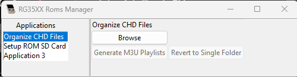
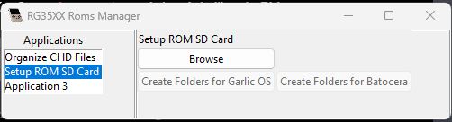

# RG35XX Roms Manager

RG35XX Roms Manager is a graphical user interface (GUI) application 
designed to help you organize your game ROM files for the Anbernic
RG35XX. This tool is very much so still in development, and I take
no responsibility for any features that aren't completely working as
desired. It is very important that you **BACK UP YOUR FILES** before
use.

## Organize CHD Files

This section helps you organize your ROMs that use the CHD format. 
It allows you to group multi-disc games into separate folders and 
generate M3U playlist files for compatibility with various 
emulators.

### Functionality

- **Organize CHD Files**: Click this button to scan the selected 
folder for CHD files and organize them into folders based on game 
titles. Multi-disc games will be grouped together, and an M3U 
playlist file will be generated for each game. The application will
display a message indicating the result of the organization process.

- **Revert Organized CHD Files**: Click this button to revert the
changes made by the "Organize CHD Files" button. It moves the CHD
files back to the root folder and deletes the M3U playlist files and
game title folders. The application will display a message 
indicating the result of the reverting process.

## Setup ROM SD Card

This section helps you create the folder structure for your SD card,
currently only supporting Garlic OS and Batocera.

### Functionality

- **Create Folders**: Click this button to create the necessary 
folder structure for the selected operating system (Garlic OS or 
Batocera) in the chosen root folder. The application will display 
a message indicating the result of the folder creation process.

**Note**: Be careful when using the "Create Folders" buttons, 
as it will remove all data within the console folders. Make sure 
to back up your data before proceeding. This function, at this time,
is intended to use on empty pre-formatted SD cards. This will become
more robust over time.

